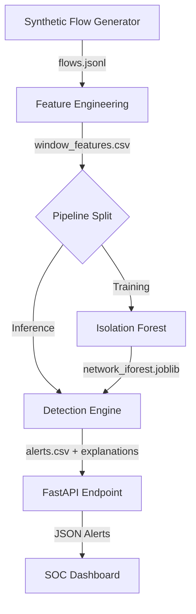

# AI-Driven Network Traffic Anomaly Detector


## Overview

An AI-powered Network Detection and Response (NDR) system that analyzes network flow telemetry, establishes behavioral baselines, and detects anomalies such as:

* Port Scanning
* Data Exfiltration
* Unusual Network Activity
* Suspicious Traffic Patterns

The system leverages an **Isolation Forest Machine Learning model** to identify deviations from normal network behavior and provides automated explanations for security analysts through a FastAPI-powered alert API.

---

## Table of Contents

* Overview
* Architecture
* Repository Structure
* Core Cybersecurity Concepts
* Feature Engineering
* Machine Learning Model
* Threat Scenarios
* Installation
* Usage
* API Example
* SOC Deployment Mapping
* Limitations
* Future Improvements

---

# Architecture



---

# Repository Structure

```text
├── data/
│   ├── raw/
│   │   └── flows.jsonl
│   └── processed/
│       ├── window_features.csv
│       └── alerts.csv
│
├── src/
│   ├── data/
│   │   └── generate_flows.py
│   │
│   ├── features/
│   │   └── build_features.py
│   │
│   ├── models/
│   │   └── train.py
│   │
│   ├── detection/
│   │   └── detect.py
│   │
│   ├── utils/
│   │   └── explain.py
│   │
│   └── api/
│       └── app.py
│
├── requirements.txt
└── README.md
```

---

# Core Cybersecurity Concepts

## What is Network Anomaly Detection?

Traditional Network Intrusion Detection Systems (NIDS) rely on signatures to identify threats.

Examples:

* Snort
* Suricata
* Zeek Rules

While effective against known attacks, signature-based systems struggle with:

* Zero-day attacks
* Insider threats
* Custom malware
* Novel attack techniques

This project uses **behavioral anomaly detection**, learning what "normal" network activity looks like and identifying deviations from that baseline.

---

## Why Flow-Level Telemetry?

Instead of analyzing packet payloads, the system processes metadata such as:

* Source IP
* Destination IP
* Ports
* Packet counts
* Byte counts
* Session duration

### Benefits

| Benefit               | Description                           |
| --------------------- | ------------------------------------- |
| Scalability           | Much smaller than PCAP files          |
| Privacy               | No payload inspection                 |
| Compliance            | Easier GDPR/HIPAA compliance          |
| Encryption Resilience | Works even with TLS-encrypted traffic |

---

# Feature Engineering

Network flows are aggregated into **1-minute windows** and transformed into machine-learning features.

| Feature          | Purpose                                      |
| ---------------- | -------------------------------------------- |
| flow_count       | Detect connection spikes                     |
| unique_dst_ports | Identify port scanning                       |
| packets_sum      | Measure traffic density                      |
| bytes_sum        | Detect data exfiltration                     |
| bytes_per_packet | Characterize traffic type                    |
| avg_duration     | Distinguish automated vs persistent activity |

---

# Machine Learning Model

## Isolation Forest

The project uses **Isolation Forest (iForest)** for unsupervised anomaly detection.

### Why Isolation Forest?

* No labeled attack data required
* Efficient on large datasets
* Works well for rare-event detection
* Low computational cost

### Complexity

```text
Isolation Forest: O(n)
k-NN / LOF: O(n²)
```

### Contamination Parameter

```python
IsolationForest(
    contamination=0.05,
    random_state=42
)
```

The contamination value assumes approximately **5% anomalous activity** within the dataset.

---

# Threat Scenarios Detected

## Port Scanning

Characteristics:

* High flow_count
* High unique_dst_ports
* Short duration
* Low bytes_per_packet

Example:

```text
Attacker → Port 21
Attacker → Port 22
Attacker → Port 80
Attacker → Port 443
```

---

## Data Exfiltration

Characteristics:

* High bytes_sum
* Long session duration
* Significant outbound traffic

Example:

```text
Internal Host → External IP
Transfer Size: 10GB+
```

---

# Installation

## Clone Repository

```bash
git clone https://github.com/yourusername/network-anomaly-detector.git

cd network-anomaly-detector
```

## Create Virtual Environment

```bash
python -m venv .venv

source .venv/bin/activate
```

## Install Dependencies

```bash
pip install -r requirements.txt
```

---

# Usage

## Step 1 — Generate Synthetic Traffic

```bash
python src/data/generate_flows.py
```

## Step 2 — Build Features

```bash
python src/features/build_features.py
```

## Step 3 — Train Model

```bash
python src/models/train.py
```

## Step 4 — Detect Anomalies

```bash
python src/detection/detect.py
```

## Step 5 — Launch API

```bash
uvicorn src.api.app:app --reload --port 8000
```

---

# API Endpoint

## Retrieve Alerts

```bash
curl http://127.0.0.1:8000/alerts
```

---

## Example Response

```json
[
  {
    "src_ip": "198.51.100.10",
    "direction": "inbound",
    "flow_count": 300,
    "unique_dst_ports": 300,
    "anomaly_score": -0.6842,
    "anomalous": true,
    "reasons": "Possible port scanning activity"
  }
]
```

---

# Real-World SOC Deployment

This architecture closely resembles commercial NDR platforms such as:

* Darktrace
* Corelight
* Cisco Secure Network Analytics

### Data Pipeline

```text
Network Sensor
      ↓
Zeek
      ↓
Kafka
      ↓
Isolation Forest
      ↓
SIEM (Splunk)
      ↓
SOAR Automation
      ↓
EDR Response
```

### SOC Workflow

1. Network telemetry collected.
2. Features generated.
3. Model scores anomalies.
4. Explanations generated.
5. Alerts forwarded to SIEM.
6. SOAR initiates automated response.

---

# Limitations

### False Positives

Legitimate activities may resemble attacks:

* Software updates
* Backup jobs
* Vulnerability scans
* Cloud migrations

### Concept Drift

As network behavior evolves over time, retraining becomes necessary.

Examples:

* New applications
* Cloud adoption
* Business growth
* Infrastructure changes

---

# Future Improvements

* Real-time Kafka ingestion
* Streaming anomaly detection
* Auto-retraining pipeline
* Grafana dashboard integration
* SIEM integrations
* SOAR automation
* MITRE ATT&CK mapping
* Multi-model ensemble detection
* Deep Learning anomaly detection

---

# Author

**Israel Mbiyavanga David (Mr. Linux)**

Cybersecurity | Incident Response | Digital Forensics | Penetration Testing | Network Security

*"Using AI and Machine Learning to strengthen modern cyber defense operations."*
